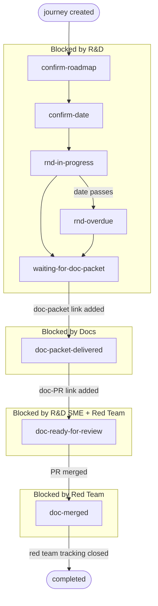

# Logos Journeys

Website to track priorities of journeys for Logos Eco Dev, on Logos R&D.

A static SPA that displays a prioritized pipeline of Logos ecosystem journeys, sourced from
GitHub Projects v2. Live at <https://journeys.logos.co>, pre-configured for
[logos-co / project 12](https://github.com/orgs/logos-co/projects/12/views/1?layout_template=board).

---

## Routing — load only what your task needs

This README is a router. **Do not read the whole repo.** Pick the one row that matches your
task and open **only** that file.

| Your task                                        | Open only this                       |
|--------------------------------------------------|--------------------------------------|
| Create / update journey issues with `gh`         | [USAGE.md](USAGE.md)                 |
| Run the app on your machine and use it           | [BUILD.md](BUILD.md)                 |
| Change the app code (tests, specs, structure)    | [CONTRIBUTE.md](CONTRIBUTE.md)       |

`USAGE.md` and `CONTRIBUTE.md` both rely on the **journey data model + lifecycle** described
just below — they tell you when you need it. If you only want to run the app ([BUILD.md](BUILD.md)),
you can skip it.

The behavior spec is [SPEC.md](SPEC.md) (per-feature, source of truth for *what* the app does).
Architecture rationale is [ADR.md](ADR.md). `CONTRIBUTE.md` routes to both.

> **LLM agents:** this file is the entry point. Read the routing table, then load the single
> persona file that matches the request — plus the **Concepts** section below only if that file
> says to. Loading all of them defeats the purpose.

---

## Concepts — journey data model and lifecycle

Shared vocabulary used by [USAGE.md](USAGE.md) and [CONTRIBUTE.md](CONTRIBUTE.md). Skip if you
only want to run the app.

### What a journey is

Journeys are GitHub issues in the connected project board (`logos-co/journeys.logos.co`,
project #12). Each issue carries:

- **Journey type label** (exactly one): `gui user`, `developer`, or `node operator`
- **Target release label** (one): `testnet v0.1`, `testnet v0.2`, … (matched by `/^testnet\b/i`)
- **Lifecycle status label** (exactly one): `status:<phase>` — auto-managed by the app
- **Blocking labels** (one or more): `blocked-by:<team>` — auto-managed from the lifecycle,
  plus any manually-added external blockers
- **Driver labels** (zero or more): `driver:<name>` from a fixed allowlist (`rfp`, `quest`,
  `sample-app`) — informational only, they record *why* a journey earned its slot and gate nothing
- A **structured issue body** (sections drive the lifecycle):

  ```markdown
  ## R&D
  - team: <name>
  - milestone: <url>      # one line per milestone, multiple allowed
  - date: <DDMmmYY>

  ## Doc Packet
  - link: <url>           # logos-docs issue from the doc-packet template; presence = delivered

  ## Documentation
  - tracking: <url>       # logos-docs issue tracking doc progress
  - pr: <url>             # the doc PR; added MANUALLY by docs as "ready for review"
  - published: <url>      # the live docs.logos.co page; set MANUALLY once published

  ## Red Team
  - tracking: <url>       # red team tracking issue
  ```

R&D team granularity — `<team>` is one of:
`anon-comms`, `messaging`, `core`, `storage`, `blockchain`, `zones`, `smart-contract`, `devkit`.
If no team is assigned yet, the blocking label is `blocked-by:rnd`.

### The lifecycle

One `status:<phase>` label per journey, one or more `blocked-by:<team>` labels. Both are
**auto-managed by the app** based on what's in the issue body. The whole lifecycle is one
linear sequence:



| `status:*` label                | Next step (who does it) — body change that advances the phase                               | Auto-derived `blocked-by:*`                      |
|---------------------------------|---------------------------------------------------------------------------------------------|-------------------------------------------------|
| `status:confirm-roadmap`        | **R&D lead**: set `- team:` and a `- milestone:` URL                                        | `blocked-by:rnd` (or `rnd-<team>`)              |
| `status:confirm-date`           | **R&D lead**: add `- date:` (DDMmmYY)                                                       | `blocked-by:rnd-<team>`                          |
| `status:rnd-in-progress`        | **R&D**: deliver the milestones (auto-advances when all are ticked in [roadmap.logos.co](https://roadmap.logos.co), source `logos-co/roadmap`) | `blocked-by:rnd-<team>` |
| `status:rnd-overdue`            | **R&D**: deliver the milestones — target date passed; update the date or close them         | `blocked-by:rnd-<team>`                          |
| `status:waiting-for-doc-packet` | **R&D**: file a [doc packet issue](https://github.com/logos-co/logos-docs/issues/new?template=doc-packet.yml), paste URL into `## Doc Packet - link:` | `blocked-by:rnd-<team>` |
| `status:doc-packet-delivered`   | **Docs**: open tracking issue (`## Documentation - tracking:`), write the doc, and when the doc PR is ready paste its URL into `## Documentation - pr:` | `blocked-by:docs` |
| `status:doc-ready-for-review`   | **R&D and Red Team**: review the doc PR. **Docs**: merge once both approve                  | `blocked-by:red-team` + `blocked-by:rnd-<team>` |
| `status:doc-merged`             | **Red Team**: finish dogfooding, close `## Red Team - tracking:` when done                  | `blocked-by:red-team`                            |
| `status:completed`              | Nothing — journey is done                                                                    | —                                               |

**Precedence rule:** when `## Documentation - pr:` is set, the status advances to
`doc-ready-for-review` / `doc-merged` / `completed` *regardless* of the R&D body fields.
Upstream R&D checks only gate the pre-doc-packet phases. (Regression #31.)

The doc PR URL is added **manually by the docs team** as an explicit "ready for review"
signal — there is no auto-discovery. External blockers (`blocked-by:legal`,
`blocked-by:security`, …) can be added manually; they coexist with the auto-managed labels and
don't affect the flow. Milestone completion is fetched at runtime from `logos-co/roadmap` via
the GitHub Contents API; overdue detection parses `- date:` as `DDMmmYY`.

Label drift (e.g. after body edits) is detected in-app — the ⚠ **Fix Labels** button in the
header reconciles every issue's `status:*` / `blocked-by:*` labels in one pass, and migrates
legacy `action:*` and `blocked:<team>` labels.

### Related repos

- `logos-co/journeys.logos.co` — journey issues live here
- `logos-co/logos-docs` — documentation, linked from the `## Documentation` section
- `logos-co/roadmap` — milestone source of truth for auto-advance
- `logos-blockchain/logos-execution-zone` — LEZ team issues
- `logos-co/ecosystem` — red team tracking issues (historical; may move)

---

## Licence

Licensed under either of [MIT](LICENSE-MIT) or [Apache 2.0](LICENSE-APACHE) at your option.
